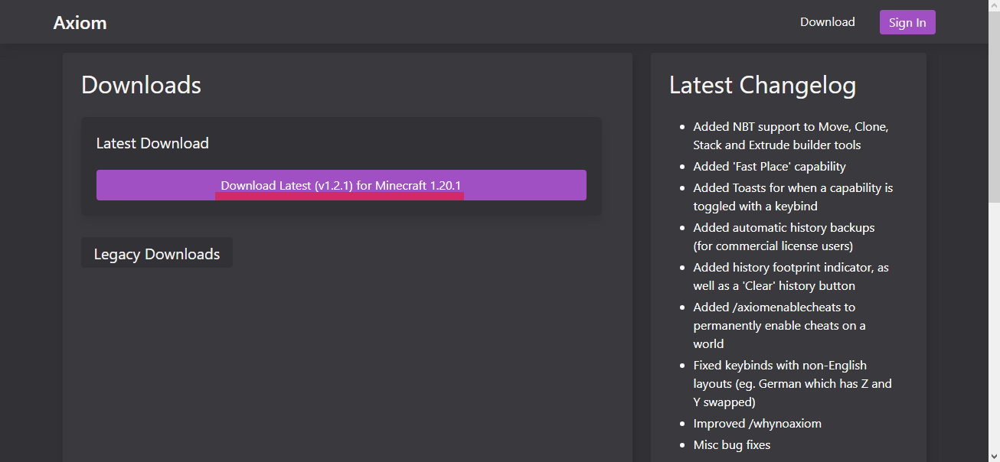
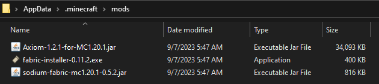

---
layout:
  title:
    visible: true
  description:
    visible: false
  tableOfContents:
    visible: true
  outline:
    visible: true
  pagination:
    visible: true
---

# How to install?(Clientside)

### Here we will describe in as much detail as possible how to install the mod.

1. First, you need to download the latest version of the mod from the official website.[DOWNLOAD](https://axiom.moulberry.com/download)

<figure><figcaption></figcaption></figure>


The mod uses Fabric mod loader, and requires Fabric-api. [LINK](https://fabricmc.net/use/installer/)

If you're using Sodium, make sure it's updated to 0.5.1+. [LINK](https://modrinth.com/mod/sodium/versions)


2. Open your Minecraft folder and locate the **mod** folder. You can use the **run** command for the easiest way to find it.&#x20;

<figure><figcaption>
For fast enter to your run command u can use Windows+R and write <strong><code>%AppData%</code></strong>
</figcaption></figure>

3. Afterward, drop your downloaded mods into the mod folder.

<figure><figcaption></figcaption></figure>

4. Fine Axiom mod has been installed.
