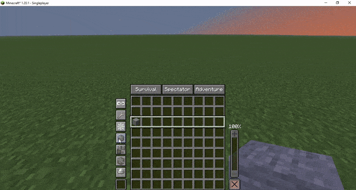

    
    <h1>Force Place</h1>

The **Force Place** capability bypasses normal placement restrictions.

- Blocks which normally need to be attached to solid blocks can be placed in mid air
- Blocks can be placed inside entities (including yourself)
- Plant blocks no longer need to be placed on farmland (or sand/dirt for sugarcane and clay for dripleaf)
- Blocks can be placed regardless of light level
- And many more!

