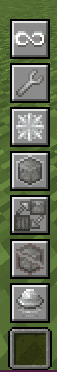

# Capabilities
This chapter covers Capabilities, toggleable features which can enhance your building workflow.

By default, the **Replace Mode** capability can be toggled using the R keybind. Toggle keybinds for all capabilities can be configured in the vanilla keybinds menu.

    

