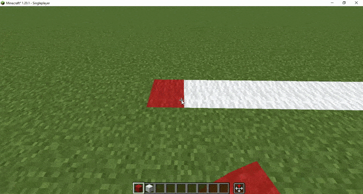

    
    <h1>Replace Mode </h1>

The **Replace Mode** capability allows you to right-click to replace the targeted block with the held block. This allows you to easily replace a large amount of blocks by holding the right-mouse button instead of needing to press left+right click for each individual block you want to replace.

Additionally, when you replace a block, the newly placed block will inherit the properties of the old block. This mechanic means that, for example, if you have a copper stair and replace it with an oak stair, the oak stair will be in the exact same orientation and shape as the original copper stair.
