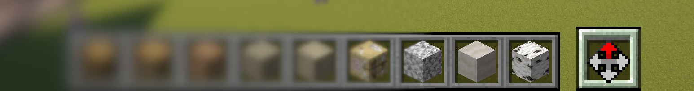

# Introduction

Welcome to the Axiom Documentation, the comprehensive book detailing the all-in-one tool for editing Minecraft worlds. The goal of Axiom is to help you build terrain, organics, and structures faster and of a higher quality. The mod brings innovative new tools and algorithms, and aids ergonomics by improving the feedback loop through real-time client-side visualizations. 

## Who Axiom Is For

Axiom is easy to learn yet hard to master, catering to Minecraft builders of all skill levels, through various levels of complexity. The most beginner-friendly tools are found in the [Builder Mode](builder/intro.md). More in-depth tools can be found in the [Editor Mode](editor/intro.md), which can be combined with [Tool Masks](editor/windows/toolmasks.md) for further complexity.

## Getting Started

Upon creating a new creative world, you should see a 10th hotbar slot containing an icon. 

    

>If you don't see this icon, use the `/whynoaxiom` command in-game and follow the provided instructions. If the issue still persists, ask for help in the official [Axiom Discord](https://discord.gg/axiomtool).

To access the [Builder Tools](builder/buildertools/intro.md) menu, first scroll to the 10th hotbar slot. Then hold **Left Alt** while that slot is selected and use the scroll wheel to navigate the options.

    

---

To access the [Context Menu](contextmenu/intro.md), hold **Left Alt** while the Axiom slot is *not* selected (slots 0-9).

    

---

- To open/close the [Editor Mode](editor/intro.md), press **Right Shift**.

    

---

###### Last Documentation Update: 8/July/25