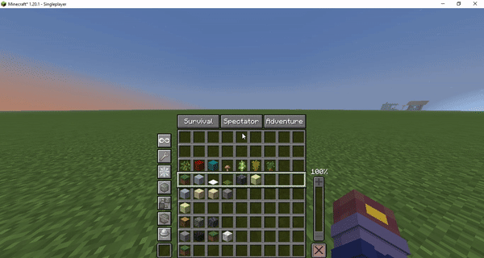
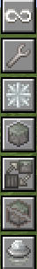
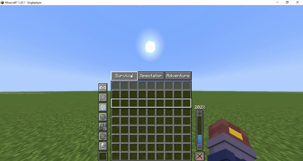
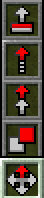

# Builder Mode(hotbar)

### Infinite fieachBuilder Context Menu 

The features for builder mode are accessed in the builder context menu. By default, holding down Left Alt opens the menu. The context menu allows you to access the features listed below.

<figure><figcaption></figcaption></figure>

### **Hotbar Swapper** 

The hotbar swapper is the most prominent feature you’ll notice when you first open the builder context menu. While the menu is open you can use your scroll wheel or number keys to quickly swap to another hotbar.

This feature aids in organization, allowing you to swap between building materials without needing to open your inventory and move things around.

You can reorganize your hotbars by clicking items like you would in any other inventory. The fastest way to fill a hotbar is to open an empty bar and fill it using the creative inventory or pick block as you normally would.

<figure><figcaption></figcaption></figure>

### Capabilities 

On the left-hand side you can find a number of buttons for toggling building **Capabilities**. A raised or lighter background means the Capability is disabled, while a depressed or darker background means the Capability is enabled. Documentation for Capabilities can be found[ **here**](capabilities/)**.**

<figure><figcaption>
1.Infinite reach 2.Tinker  3. No Updates 4. Force Place 5. Replace Mode 6. BulIdozer 7. Enhanced Flight
</figcaption></figure>

### Gamemode Switchers 

Above the hotbar swappers are 3 buttons for quickly swapping to other gamemodes. Using these buttons can be slightly faster than messing around with F3+F4 or chat commands.

<figure><figcaption></figcaption></figure>


Pressing Left Alt while not in creative mode will put you into creative mode, this can be useful if you are in spectator mode and want to swap back to place some blocks.


### Flight Speed 

On the right-hand side you can find a slider which allows you to quickly change your flight speed, up to 1000% or 10x faster.

<figure><figcaption></figcaption></figure>

### Sidebar _(right hand)_&#x20;

On your right hand, you have an additional slot for building and editing your projects. To use it, you need to select the 10th slot with the mouse wheel and use Alt+Left to select the mode. For more details, you can find them \[LINK].

<figure><figcaption>
1.Move 2.Clone 3.Stack 4.Smear 5.Extrude  
</figcaption></figure>
