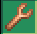

# Tinker

The **Tinker** capability has various features related to right-clicking with your fist on blocks. Tinker often can be used in place of the debug stick, being slighty faster compared to the debug stick's clunky interface but sometimes lacking the ability to change some non-visual properties.

Aiming at specific parts of a block can change the effect of the tinker. This lets you quickly change full blocks into stairs, stairs into slabs and vice versa. It also lets you easily adjust walls/fences to create states that Minecraft normally doesn’t allow.

Tinker interactions can be negated while the capability is toggled on by either having a non-empty hand or by holding down the sneak or ‘shift’ button.

<figure><figcaption></figcaption></figure>

 

<figure><figcaption></figcaption></figure>

<table><thead><tr><th width="279">Block</th><th>Tinker Effect</th></tr></thead><tbody><tr><td>Blocks with full/stair/slab variants</td><td>Convert between full/stair/slab by adding/removing corners</td></tr><tr><td>Walls</td><td>Cycle WallSide (none/low/tall) of targeted side</td></tr><tr><td>Fences/Iron bars</td><td>Toggle north/east/south/west sides</td></tr><tr><td>Piston</td><td>[Side] Change facing, [Front] Extends/retracts the piston</td></tr><tr><td>Furnace</td><td>[Side] Change facing, [Front] Toggles lit state</td></tr><tr><td>Carved Pumpkin/Jack O Lantern</td><td>[Side] Change facing, [Front] Swaps between the 2 blocks</td></tr><tr><td>Barrel</td><td>[Side] Change facing, [Front] Opens/closes</td></tr><tr><td>Iron Trapdoor/Door</td><td>Open/closes the block</td></tr><tr><td>Brewing Stand</td><td>Add/remove bottles</td></tr><tr><td>Glazed Terracotta</td><td>Change facing</td></tr><tr><td>Farmland</td><td>Cycle moisture</td></tr><tr><td>Scaffolding</td><td>Toggle bottom</td></tr><tr><td>Small/Medium/Large/Cluster Amethyst</td><td>Cycles between the 4 blocks</td></tr><tr><td>Lectern</td><td>Toggles book</td></tr><tr><td>Candle/Campfire/Redstone Torch</td><td>Toggles lit</td></tr><tr><td>Cave Vines</td><td>Toggles berries</td></tr><tr><td>Bamboo Stalk</td><td>Toggles bamboo leaves</td></tr><tr><td>Cauldron</td><td>Cycles fluid level</td></tr><tr><td>Composter</td><td>Cycles compost level</td></tr><tr><td>Powered Rail</td><td>Toggles powered</td></tr><tr><td>Beehive</td><td>Cycles honey level</td></tr><tr><td>Any block with 'Age' property</td><td>Cycles age</td></tr><tr><td>Cake</td><td>Cycles bites</td></tr></tbody></table>

Additionally:

* Right-clicking with Moss Block on cobblestone/stone converts the block into its mossy variant
* Right-clicking with Shears on removes mossy
* Right-clicking on a pot with a plant replaces the plant inside the pot
